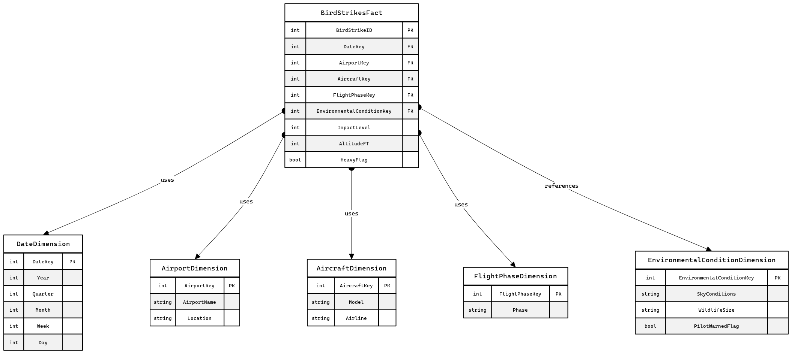

## Question 1 
Data warehouses are often constructed using relational databases. Explain the use of fact tables and star schemas to construct a data warehouse in a relational database. Also comment on whether a transactional database can and should be used to house an OLAP. Lastly, why would an organization use a relational database with a star schema rather than a dedicated NoSQL database specifically engineered for data warehousing and analytics?

## Solution:

### Introduction

Data warehousing is an important component of business intelligence and analytics, as it provides firms with a consolidated store for data acquired from diverse sources. Relational databases are essential for building data warehouses, as they use structures such as fact tables and star schemas to efficiently arrange data. 

### Fact Tables and Star Schemas in Relational Databases

**Fact Tables:** Being the core of a data warehouse's dimensional model Fact tables are designed to store quantitative metrics for analysis. These tables contain facts or measurements that are specific to a business process, such as sales revenue, quantity sold, or any other transactional metric. Fact tables are linked to dimension tables through foreign keys, which represent different dimensions of data, such as time, geography, product, and customer demographics. The primary purpose of a fact table is to enable the analysis of business performance metrics across various dimensions.

**Star Schemas:** The star schema is a simplified database schema used in creating data warehouses. It consists of a central fact table surrounded by dimension tables, resembling a star. This schema is favored for its simplicity, performance benefits, and ease of understanding. Each dimension table in a star schema is directly related to the fact table, making queries less complex and faster than those in more normalized databases. The direct relationships facilitate efficient data retrieval for analytical queries, making the star schema particularly suitable for OLAP operations.

Star schemas simplify the data model, making it more accessible for users to create reports and perform data analysis. The denormalized structure enhances query performance by reducing the number of joins needed to retrieve data. Additionally, star schemas are adaptable, allowing for the easy addition of new dimensions without significantly altering the existing database structure.

### OLAP in Transactional Databases: A Feasibility Discussion

Transactional databases, designed for Online Transaction Processing (OLTP), prioritize fast, atomic transactions. These databases are optimized for a high volume of short transactions that ensure data integrity and accuracy. Conversely, OLAP systems are designed for complex queries and data analysis, requiring a different architectural approach.

While it's technically possible to run OLAP operations on a transactional database, it's not ideal due to performance and operational constraints. Transactional databases are optimized for operational efficiency rather than analytical depth, leading to potential performance bottlenecks when used for OLAP. Therefore, it's preferable to separate OLTP and OLAP workloads, using data warehousing techniques to house OLAP systems. This separation ensures that the transactional system's performance is not compromised by the intensive analytical processing required by OLAP.

### Relational Databases vs. NoSQL for Data Warehousing

Choosing between relational databases with star schemas and NoSQL databases for data warehousing hinges on several factors, including the nature of the data, the complexity of the queries, and the scalability requirements. 

Relational databases are well-suited for structured data and are highly efficient for complex queries that involve multiple joins,thanks to their schema-based organization. The star schema, in particular, simplifies query operations, making it easier for businesses to perform multidimensional analysis. Additionally, relational databases' ACID (Atomicity, Consistency, Isolation, Durability) properties ensure data integrity and reliability, which is crucial for accurate reporting and analysis.

NoSQL databases, on the other hand, offer superior scalability and flexibility for unstructured or semi-structured data. They are designed to handle vast volumes of data across distributed systems, making them ideal for big data applications. However, the lack of a fixed schema can complicate the development of consistent analytical reports and may require additional processing to perform multidimensional analysis.

**Conclusion:** The decision to use a relational database with a star schema over a NoSQL solution depends on the requirements of the data warehousing project. Relational databases offer advantages in data integrity, transaction consistency, and ease of use for complex analytical queries, making them suitable for scenarios where these factors are paramount. In contrast, NoSQL databases are preferred for their scalability and flexibility in handling large volumes of unstructured data.

## Question 2
Explain the difference between a data warehouse, a data mart, and a data lake. Provide at least one example of their use from your experience or find out how they are generally used in practice. Find at least one video, article, or tutorial online that explains the differences and embed that into your notebook.

## Solution:
**Data Warehouse**: It is a centralized repository designed to store integrated data from multiple sources. It is structured and processed for query and analysis purposes, supporting business intelligence activities including analytics, reporting, and data mining. It contains historical data that has been cleansed, enriched, and structured into a schema that is optimized for fast queries and analysis. Data is loaded through an ETL (Extract, Transform, Load) process.
Example: In my previous experience at Intel, we created a internal data warehouse to integrate the availablility of various data centers across the geography and the reasons for the downtime to analyze overall operational efficiency, forecast production needs, and optimize inventory levels.

**Data Mart**: A data mart is a subset of a data warehouse focused on a specific business line or department. It is designed to meet the specific needs of a particular group of users in terms of content, scope, and data organization.Being more focused, data marts are quicker to develop and provide faster access to data. They usually deal with a single area of business like finance, sales, or marketing.
Example: In my same previous experience at Intel a data mart was dedicated(based on the reasons of downtime, and the geographically requirements) to the development team, containing data specifically structured for analyzing downtime trends, utilization effectiveness, and customer segmentation to better target efficient datacenters.

Data Lake: A data lake is a vast pool of raw data stored in its native format until it is needed. Unlike a data warehouse, a data lake is designed to store all types of data: structured, semi-structured, and unstructured. Data lakes are highly scalable and can handle massive volumes of data. They support the storage of data without the need for a predefined schema, making them flexible in handling various types of data from different sources.
Example: In one of my previous project 'Scenescape' an ML to detect movement inside a given space, we used a data lake to store everything from sensor data in cameras, logs from detections, power consumption data, to social media feedback.

Here are the reference links:

[blog link](https://www.remedi.com/blog/data-warehouse-vs.-data-lake-vs.-data-mart-the-easy-guide "Article")

[video link](https://www.youtube.com/watch?v=FxpRL0m9BcA "Video Reference")

## Question 3
After the general explanation of fact tables and star schemas, design an appropriate fact table for Practicum I's bird strike database. Of course, there are many fact tables one could build, so pick some analytics problem and design a fact table for that. For example, you might want to build a fact table for "birdstrike facts", such as the average and total number of bird strikes by time periods (weeks, months, years), or bird strikes by region or airport and, again, broken down by time period. This might be useful for time series analysis or to determine seasonality for bird strikes which might then inform notices to pilots. Be sure to explain your approach and design reasons.

Just design it (ideally by creating an ERD for it); you do not need to actually implement it or populate it with data (of course, you may do so if you wish in preparation for the next practicum).

## Solution:
Analytics Problem Focus
Focusing on an analytics problem that aims to identify patterns and seasonality in bird strike incidents, which could help in issuing timely notices to pilots and adjusting flight schedules or routes. The analysis might include identifying high-risk airports, time periods (months, days), or conditions (e.g., sky conditions, flight phases) for bird strikes.

Fact Table Design
Given this focus, our fact table will centralize around bird strike incidents, with dimensions that enable detailed analysis on when and how these incidents occur. Each record in the fact table represents a bird strike event.

**Fact Table**: BirdStrikesFact

Columns:
BirdStrikeID (Primary Key): A unique identifier for each bird strike incident.
DateKey (Foreign Key): References the Date dimension table, for analyzing time series and seasonality.
AirportKey (Foreign Key): References the Airport dimension table, to analyze location-based patterns.
AircraftKey (Foreign Key): References the Aircraft dimension table, including model and possibly airline for deeper analysis on which aircraft are more prone to strikes.
FlightPhaseKey (Foreign Key): References the FlightPhase dimension table, to analyze at which phase of flight (e.g., takeoff, landing) bird strikes are most common.
EnvironmentalConditionKey (Foreign Key): References the EnvironmentalCondition dimension table, capturing sky conditions, wildlife size, and whether the pilot was warned.
ImpactLevel: Measures the severity of the impact, could be a numerical scale based on the damage.
AltitudeFT: The altitude at which the bird strike occurred, useful for identifying risk at different flight levels.
HeavyFlag: Indicates if the aircraft was classified as heavy, which might correlate with different risk levels or impact severities.

**Dimension Tables**
Date Dimension (DateKey, Year, Quarter, Month, Week, Day): Supports time series analysis and identifying seasonality.
Airport Dimension (AirportKey, AirportName, Location): Allows for location-based analysis.
Aircraft Dimension (AircraftKey, Model, Airline): Facilitates analysis based on aircraft type or airline.
FlightPhase Dimension (FlightPhaseKey, Phase): Useful for understanding at which flight phase strikes occur most.
EnvironmentalCondition Dimension (EnvironmentalConditionKey, SkyConditions, WildlifeSize, PilotWarnedFlag): Captures various environmental factors at the time of the strike.

**Design Reasons**
Granularity: The fact table is designed at the granularity of individual bird strike incidents, enabling detailed analysis.
Focus on Analysis Needs: Dimensions are chosen based on their relevance to the analytics problem focus—identifying patterns and seasonality in bird strikes.
Flexibility for Aggregation: The structure supports aggregation and slicing of data across various dimensions, crucial for analytics and reporting.

